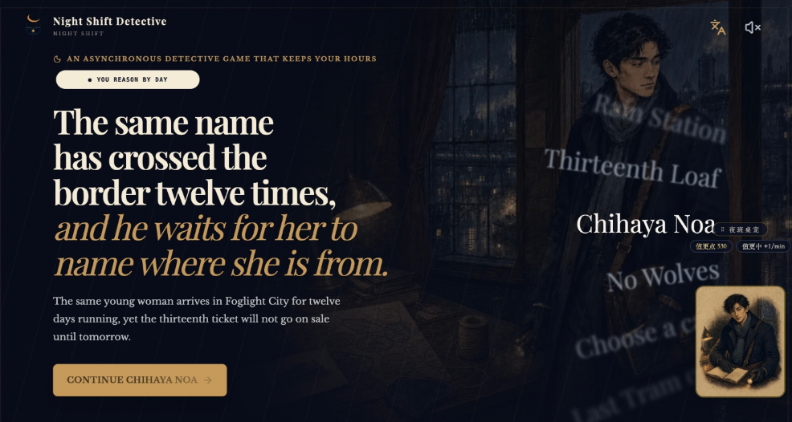
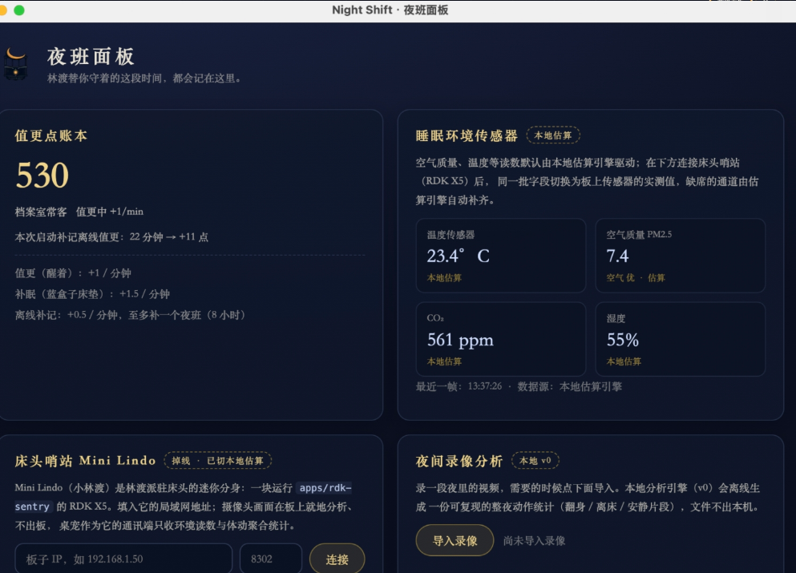

# ShiftX · Night Shift
🎉 **AdventureX 2026**

- 🥇 Amazon Quick × First Prize
- 🏆 Injective Blockchain × AI Innovation Award



你睡着以后，他开始工作。

- 在 Night Shift 中，玩家扮演侦探林渡的助手：玩家入睡时，林渡继续探索案件；清醒时，玩家整理证据、分析推理，并定下今晚的调查方向。
- 配套开源原型 **Mini Lindo** 包含桌宠、RDK X5 床头环境哨站与 Home Assistant 空间桥，让现实空间以可选、克制的方式回应夜班。
- ShiftX 旨在为「休息」带来更多趣味。产品定位见 [产品概览](docs/product-overview.md)，设计见 [北极星](docs/north-star.md)。

欢迎大家来伦敦当侦探并睡个好觉~！

## 设计
             

- 维多利亚风格与 COC 结合
- 引入工业设备的立体模型
- 玩家可以将游戏中的藏品放于 Injective 区块链上。
- 视觉规则与生成提示词见 [美术方向](docs/art-direction.md)。

## 硬件

- 游戏之外，**Mini Lindo** 把林渡带到桌面与床头
- 当前可运行的真机原型以地瓜 RDK X5 为例，读取已接入的温湿度、空气质量与可选摄像头体动摘要
- Electron 桌宠接收环境读数和板端聚合统计
- Home Assistant 空间桥只对用户显式绑定的白名单灯、场景、开关...有限夜班

套件当前的落地形态：[RDK X5 哨站](docs/rdk-x5-sleep-sentry.md)，[传感器指南](docs/mini-lindo-sensor-guide.md)）+ Electron 桌宠通讯端 + Home Assistant [空间桥](docs/home-assistant-ambient-bridge.md)。



## 书架

- 五夜剧本，各自拥有独立线索、推理、结局和本地存档，覆盖中英文
- 同一夜班运行时可继续接入新的 `CampaignManifest`（见 [案件创作指南](docs/campaign-authoring.md)）。

- [零点四十三分的末班车](docs/story-bible.md)
- [只在雨中播出的电台](docs/rain-radio-story-bible.md)
- [面包奇谈](docs/thirteenth-loaf-story-bible.md)
- [千早诺亚的现身](docs/chihaya-noa-story-bible.md)
- [雾中无狼](docs/fog-without-wolves-story-bible.md)

## 开始

```bash
npm install
npm run dev
```

打开 `http://localhost:3000`。存档保存在浏览器 `localStorage` 的 `night-shift-save-v1` 中。

**Demo Mode**：点击右上角 `DEMO` 或按 `Shift + D`，可跳到任意一夜、解锁完整案件板、快速满足真结局条件或重置本地存档。[演示脚本](docs/demo-script.md)

## 地图

- `app/` + `src/` — Next.js 主游戏（内容、状态、i18n、案件包）
- `apps/desk-pet/` — Electron 桌宠：林渡值更、睡眠报告，Mini Lindo 套件的通讯端
- `apps/rdk-sentry/` — Mini Lindo 套件的 RDK X5 
- `apps/connector/` + `tools/home-assistant-bridge/` — Mini Lindo 套件的智能家居网关：Home Assistant 空间外设桥与桌面连接器
- `contracts/` + `ignition/` — Injective EVM Testnet 藏品合约（Hardhat）
- `docs/` — 稳定知识，入口 [docs/index](docs/index.md)
- `plans/` — 施工期临时计划，入口 [PLANS](PLANS.md)

## 扩展

可选：

- **AI 晨间短笺** — “放下纸条”默认使用确定性本地回信。启用玩家逐夜授权的 AI 个性化短笺需服务端同时配置 `OPENAI_API_KEY`、`REST_REFLECTION_ACCESS_CODE`、`UPSTASH_REDIS_REST_URL`、`UPSTASH_REDIS_REST_TOKEN`，缺一保持本地回信；`REST_REFLECTION_DAILY_BUDGET` 调整每日预算（默认 200），可选 `OPENAI_BASE_URL` / `OPENAI_MODEL` 接 OpenAI-compatible 服务。模型只从固定枚举选择语气意象，短笺由服务端安全模板组成，不进入线索或结局计算。
- **Injective 测试网藏品** — 已解锁收藏品可选择性领取为 ERC-721；未配置时界面诚实展示“链上档案尚未开门”。`npm run contract:compile && npm run contract:test`，部署与环境变量见 [Injective 藏品铸造](docs/injective-keepsake-mint.md)。
- **睡眠硬件** — 网页内虚拟睡眠设备与 Xiaomi Watch S4 真实接入 PoC，见 [睡眠硬件指南](docs/sleep-hardware-user-guide.md) 与 [Xiaomi Watch 测试](docs/xiaomi-watch-hardware-test.md)。
- **Mini Lindo 睡眠套件** — `npm run pet:install && npm run pet:start` 启动桌宠；床头哨站在 RDK X5 上跑 `python3 apps/rdk-sentry/sentry.py`（任意机器加 `--mock` 联调），见 [RDK X5 哨站](docs/rdk-x5-sleep-sentry.md) 与 [传感器指南](docs/mini-lindo-sensor-guide.md)。
- **Home Assistant 空间桥** — `npm run bridge:start` 或桌面连接器 `npm run connector:start`，用受限实体做夜班环境 cue，见 [空间桥](docs/home-assistant-ambient-bridge.md)。
- **海报序列** — `/posters` 提供五日案件碎片海报的网页预览与打印入口，见 [海报序列指南](docs/poster-series-guide.md)。
- **移动端打包** — Capacitor 打 Android APK / iOS App，`npm run mobile:build:android` 等命令见 [移动端打包](docs/mobile-app-packaging.md)。

所有设备与健康信号只丰富叙事，详见 [隐私与护栏](docs/privacy-and-guardrails.md)。

## 验证

```bash
npm test              # 单元与内容测试
npm run lint
npm run build
npm run docs:check    # 文档双链检查
```

[quality-baseline](docs/quality-baseline.md),`npm run test:robustness`（渲染快照 + 合约编译测试 + Playwright E2E，也可用 `test:e2e` / `test:render` / `contract:*` 单跑）。

## Graph-Prompt-For-Agent-Loop

ShiftX 的工程目录本身就是一个高度优化过的图提示词工程。

我们提出了一套富有成效的图提示词，以驱动任意 Coding Agent（如 Kiro / Qoder / Step 等）在较长的时间内持续完成开发任务：

- **Plans 的幂等**：多人协同开发时，每个 Agent 所获取的 Plans 在创建和关闭时均幂等，不会互相污染，并可进行前后溯源（规范见 [plans/README](plans/README.md)，活跃索引见 [PLANS](PLANS.md)）。
- **原则检验**：AI 需要使用 Playwright 或自带浏览器对所有涉及到的改动部分进行全部校对和比对，如果检测到美学或原则不符的部分，则打回重改。
- **文档沉淀**：多人开发的 Coding Agent 之间的重大信息同步（见 [文档维护规范](docs/documentation-guide.md)）。

ShiftX 的初版开发由 Agent 运行 12 小时完成，并在后续的 2 天开发中并发了 100 多个 PR，最终成功上线。完整代理手册从 [AGENTS](AGENTS.md) 开始。

## 部署

部署排障见 [Hackathon Submit package](docs/hackathon-submission-kit.md)。

## 协作

- 开发代理与协作规范从 [AGENTS](AGENTS.md) 开始：`main` 受保护，一切变更走主题分支 + PR。
- 知识入口 [docs/index](docs/index.md)；剧本翻译规范见 [翻译指南](docs/translation-guide.md)；工程结构见 [架构](docs/architecture.md)。
- 视觉规则见 [美术方向](docs/art-direction.md)，主视觉与生成提示词见 `docs/art-prompts/`。

Hackathon roadshow：


